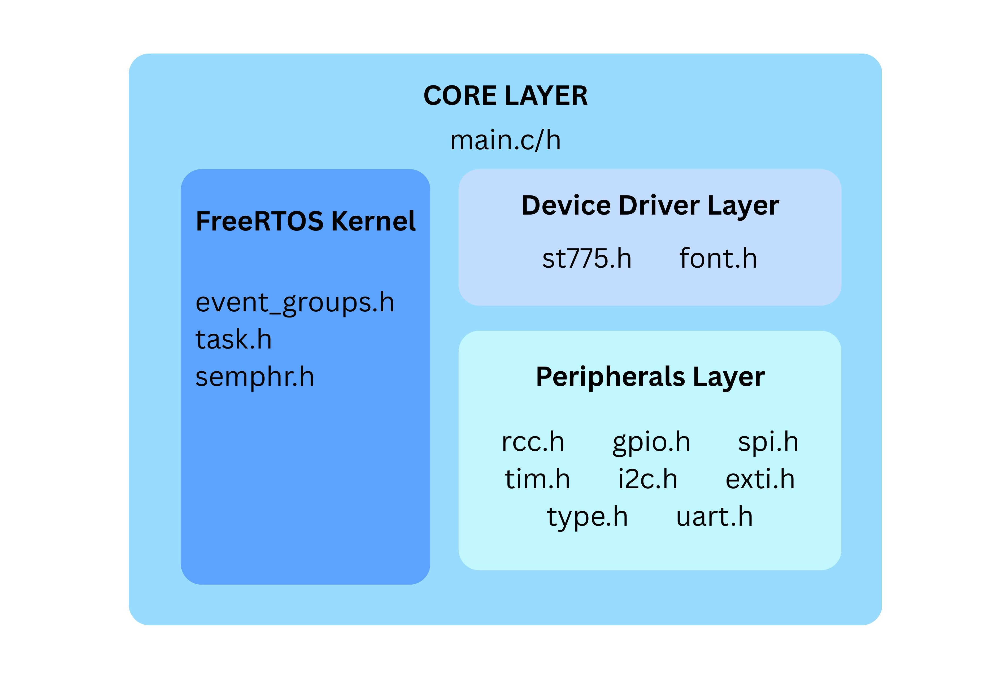
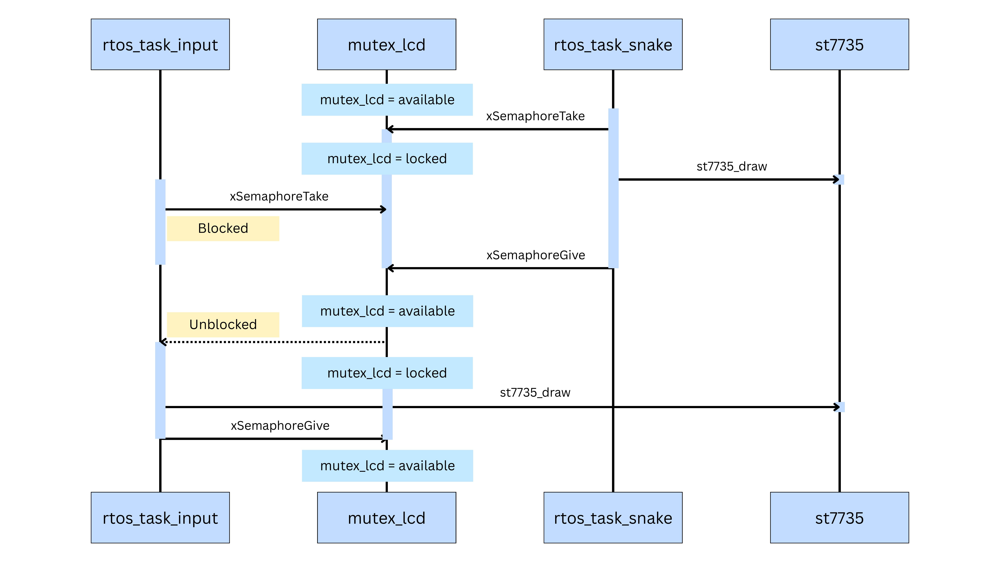
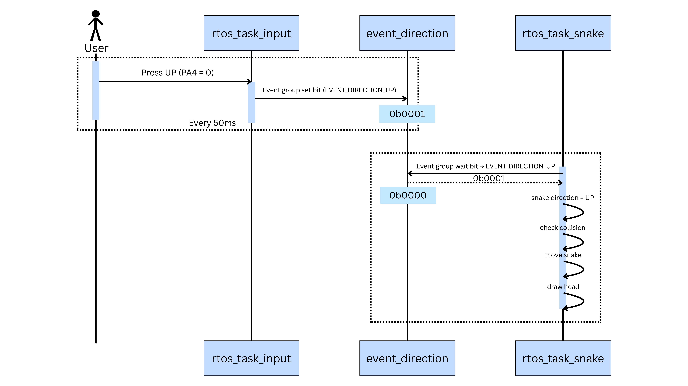
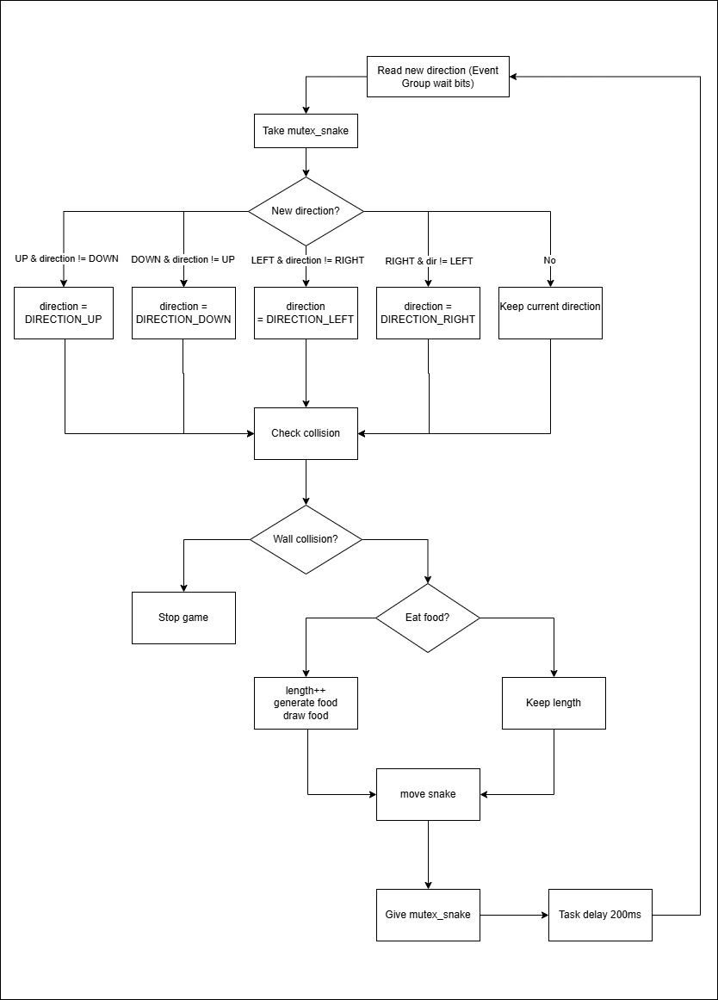

# Bare-metal FreeRTOS Snake Game
The project uses FreeRTOS to manage concurrent tasks (input polling and game logic), employing Mutexes to prevent display race conditions and Event Groups for task synchronization.
All peripheral configurations (RCC, GPIO, AFIO, SPI, Timer, I2C, UART, and EXTI) are programmed directly at the bare-metal register level.

## Architecture

## Sequence Diagram

##### Mutex LCD

##### Event Group

## Flowchart
##### Task Snake
